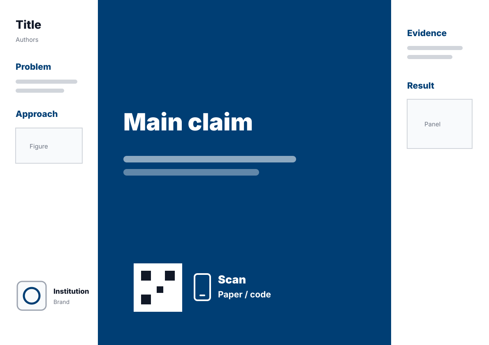
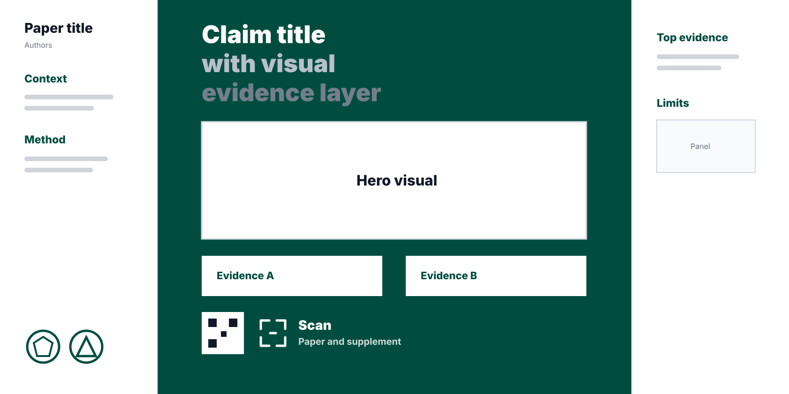

# Better Poster Skill

Better Poster Skill helps Codex, Claude, or other AI agents turn a paper PDF, figure screenshots, extracted paper text, or a LaTeX source archive into a Better Poster-style academic poster.

The default template follows the Rafael Bailo / Mike Morrison #betterposter silhouette: two compact white sidebars, one saturated central billboard, a very large plain-English main finding, a bottom-centered QR/download block in the center column, and institution branding at the bottom of the left column. The MIT Communication Lab article is used as the optional enhanced mode for technical posters that need a central hero visual and stronger visible evidence.

## Template previews

### Classic Better Poster



Use this when the user asks for a Rafael-style Better Poster, billboard poster, minimal claim-first poster, or direct template replication.

### MIT-informed EvenBetter Poster



Use this when the paper needs a hero visual, visible central evidence, or a stronger technical conversation layer.

## Supported inputs

- Paper PDF.
- LaTeX source archive or project directory.
- Extracted paper text, Markdown, or pasted abstract/method/results.
- Figure screenshots, result panels, method diagrams, or visual abstracts.
- Paper/code/project URLs, including OpenReview, arXiv, GitHub, project pages, or slides.
- Institution or affiliation text for logo/name resolution.

## Supported outputs

All poster entry templates live under `templates/`.

- **Classic LaTeX**: `templates/classic.tex` using `templates/betterposter.cls` and the familiar `\betterposter{main}{left}{right}` structure.
- **Classic HTML**: `templates/classic.html`, standalone and printable as A0 landscape.
- **EvenBetter LaTeX**: `templates/evenbetter.tex`, a MIT-informed variant with central claim, hero visual, evidence cards, and QR.
- **EvenBetter HTML**: `templates/evenbetter.html`, the same enhanced layout in standalone HTML.
- **Preview artifacts**: PDF and PNG previews through `render_preview.py` when local dependencies are available.
- **QR codes**: generated into `figures/qr/`.
- **Institution brand**: `assets/institutions/current-logo.png` plus institution name, placed at the bottom of the left column.

## Files

- `SKILL.md`: Codex skill instructions.
- `system_prompt.txt`: prompt for Claude or other multimodal agents.
- `templates/`: all poster templates and shared LaTeX class.
- `templates/betterposter.cls`: lightweight Better Poster class compatible with the public command interface documented by Rafael Bailo's template.
- `templates/classic.tex`: classic Better Poster LaTeX template, intentionally close to the Rafael example layout.
- `templates/evenbetter.tex`: MIT-informed enhanced LaTeX template.
- `templates/classic.html`: classic Better Poster HTML template.
- `templates/evenbetter.html`: MIT-informed enhanced HTML template.
- `docs/previews/`: static template preview diagrams used in this README.
- `render_preview.py`: compile LaTeX or render HTML/PDF previews.
- `scripts/generate_qr.py`: generate icon-centered QR codes for poster URLs.
- `scripts/resolve_institution_logo.py`: infer/download an institution logo from source text or an explicit institution name.
- `assets/institutions/`: on-demand institution logo cache.
- `assets/logos/`: optional saved OpenReview, ICML, ICLR, and NeurIPS logo assets when available.

## Install

```bash
mkdir -p ~/.codex/skills
cp -R Better-Poster-Skill ~/.codex/skills/better-poster
```

## Use

```text
Use $better-poster to turn this paper PDF into both a LaTeX and HTML Better Poster.
```

For the strict Rafael-style layout:

```text
Use $better-poster classic mode and keep it close to Rafael Bailo's example.png.
```

For the MIT-informed variant:

```text
Use $better-poster evenbetter mode with a hero visual and central evidence cards.
```

## Preview commands

Classic LaTeX:

```bash
python render_preview.py templates/classic.tex --out-dir build/classic-latex
```

EvenBetter LaTeX:

```bash
python render_preview.py templates/evenbetter.tex --out-dir build/evenbetter-latex
```

Classic HTML:

```bash
python render_preview.py templates/classic.html --out-dir build/classic-html
```

EvenBetter HTML:

```bash
python render_preview.py templates/evenbetter.html --out-dir build/evenbetter-html
```

The preview script copies/compiles the source and renders PNG previews when local dependencies are available. It also warns when obvious placeholder text remains.

## QR codes

Generate the primary paper QR with the label `Paper` so the templates can use `figures/qr/01-paper.png` automatically:

```bash
python scripts/generate_qr.py \
  --url Paper=https://example.com/paper \
  --url Code=https://github.com/user/repo \
  --out-dir figures/qr
```

The primary QR block is centered in the bottom band of the center column, matching the classic Better Poster visual path.

## Institution branding

Resolve an institution logo explicitly:

```bash
python scripts/resolve_institution_logo.py \
  --institution "Massachusetts Institute of Technology"
```

Or infer it from a LaTeX/text source:

```bash
python scripts/resolve_institution_logo.py --source paper.tex
```

The templates live one directory below the repository root, so LaTeX figure paths inside `templates/*.tex` use `../figures/...` and `../assets/...`. The institution brand area always includes both a logo slot and an institution name; if the logo is unavailable, the template still shows a visible placeholder plus the institution name.

## Color palettes

The templates keep the side columns white and vary the central billboard color. Use one of these palette names/classes:

- `imperial` / `theme-imperial`
- `empirical` / `theme-empirical`
- `theory` / `theme-theory`
- `methods` / `theme-methods`
- `plum` / `theme-plum`
- `amber` / `theme-amber`

Use high-contrast central text. Amber uses dark text; the other palettes use white text.

## References

- Rafael Bailo, Better Poster LaTeX template: https://github.com/rafaelbailo/betterposter-latex-template
- Rafael Bailo, example layout: https://github.com/rafaelbailo/betterposter-latex-template/blob/master/example.png
- MIT Communication Lab, Toward an Even Better Poster: https://mitcommlab.mit.edu/be/2023/09/27/toward-an-evenbetterposter-improving-the-betterposter-template/

## License

This repository remains MIT licensed. The included `templates/betterposter.cls` is a lightweight compatible implementation for this skill and is not a vendored copy of Rafael Bailo's GPL-licensed class.

Review institution logo copyright, trademark, and attribution requirements before redistributing generated logo files.

Suggestions, issues, and improvements are welcome.
