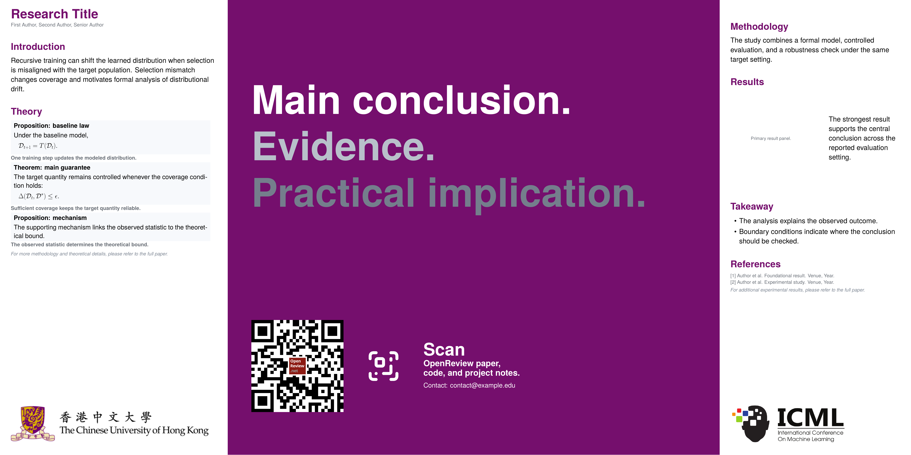

# Better Poster Skill

[English](README.md)

Better Poster Skill 用于帮助 code agent 将论文材料转换为可编辑的 Better Poster 风格学术海报。

当你有论文 PDF、LaTeX 源码压缩包、论文文本摘录、图表、截图、项目链接，或者已有海报草稿需要重新设计时，可以使用这个项目。

## 模板预览



## 这个项目提供什么

- 可复用的学术海报模板，支持主结论优先和证据展示优先两类海报结构。
- 可编辑的 LaTeX 海报源码。
- 按需生成的独立 HTML 海报源码。
- 在本地依赖可用时生成 PDF/PNG 预览图。
- 根据 paper、code、project、slides 等链接自动生成 QR/download 区域。
- 在资源可匹配时自动加入机构和会议标识。
- 持续扩充的 `examples/` 示例库，帮助 agent 为新论文参考过往成功海报的结构、信息密度和视觉组织方式。

## 你需要准备什么

尽量提供以下材料：

| 内容 | 示例 |
|---|---|
| 论文内容 | PDF、LaTeX 源码压缩包、Markdown/text 摘录、粘贴的论文段落 |
| 输出格式 | LaTeX、HTML，或两者都要 |
| 链接 | Paper、code、project page、slides、OpenReview |
| 机构信息 | 机构名称或作者 affiliation 文本 |
| 图表素材 | 方法图、结果图、定性结果、截图 |
| 联系方式 | 邮箱、项目主页、实验室主页 |
| 偏好说明 | 目标会议、海报尺寸、偏好的风格、希望突出的内容 |

论文内容是最重要的输入。额外的链接和机构信息可以帮助 agent 完成 QR 区域和视觉标识。

## 怎么使用

先把本仓库安装为 Codex skill，然后让 code agent 基于论文材料生成或修改海报。

```bash
mkdir -p ~/.codex/skills
cp -R Better-Poster-Skill ~/.codex/skills/better-poster
```

示例请求：

```text
Use $better-poster to generate an academic poster from this paper.

Paper source:
- [attach paper.pdf, provide a LaTeX source archive, or paste paper sections]

Preferences:
- Output: both LaTeX and HTML
- Paper URL: [optional]
- Code URL: [optional]
- Institution / affiliation: [optional]
- Contact line: [optional]
- Key figures to reuse: [optional]
```

agent 会阅读论文材料，选择合适的海报结构，整合可用资源，生成所需源码，并在条件允许时渲染预览。

## 输出什么

根据你的请求和本地依赖情况，agent 可以返回：

- 海报源码文件。
- 用于视觉检查的渲染预览。
- 连接到你提供链接的 QR/download 区域。
- 在资源可支持时加入的机构和会议标识。
- 简短的文件变更、预览位置和仍需人工检查内容说明。

## 人工检查

正式投稿、展示或分发前，请人工检查：

- 科学表述和主结论。
- 公式、定理和理论内容的压缩是否忠实。
- 图表裁剪和 caption。
- 引用准确性。
- 作者、机构、会议和 logo 使用。
- 最终渲染版面。

AI 可以加速海报初稿生成，但最终学术判断仍应由作者完成。

## 参考来源

- Rafael Bailo, Better Poster LaTeX template: https://github.com/rafaelbailo/betterposter-latex-template
- MIT Communication Lab, Toward an Even Better Poster: https://mitcommlab.mit.edu/be/2023/09/27/toward-an-evenbetterposter-improving-the-betterposter-template/

## License

This repository remains MIT licensed. The included `templates/betterposter.cls` is a lightweight compatible implementation for this skill and is not a vendored copy of Rafael Bailo's GPL-licensed class.

重新分发生成的 logo 文件前，请检查机构 logo 的版权、商标和署名要求。

[English](README.md)
